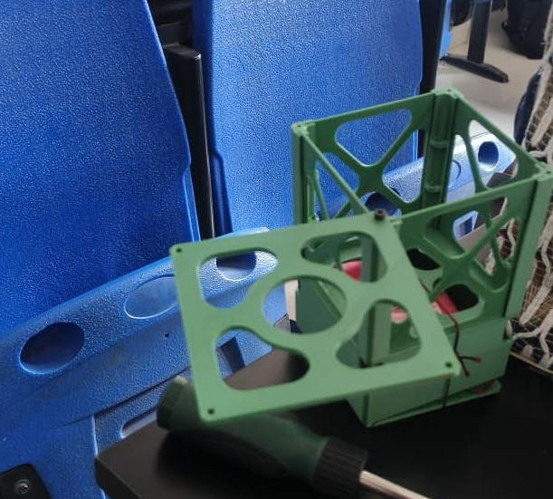
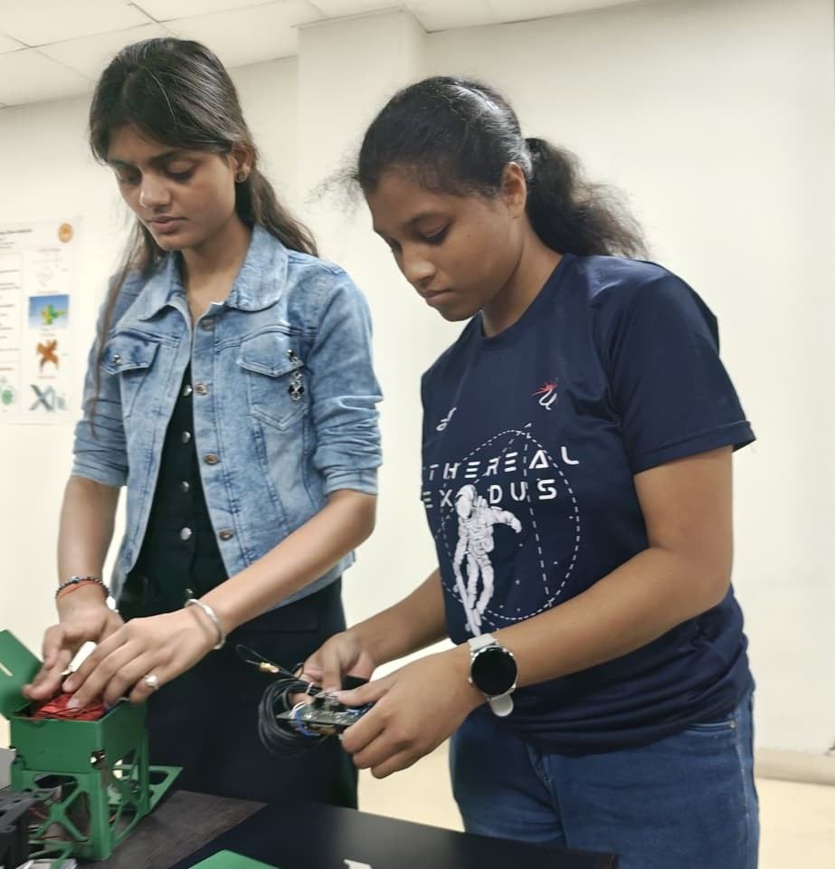
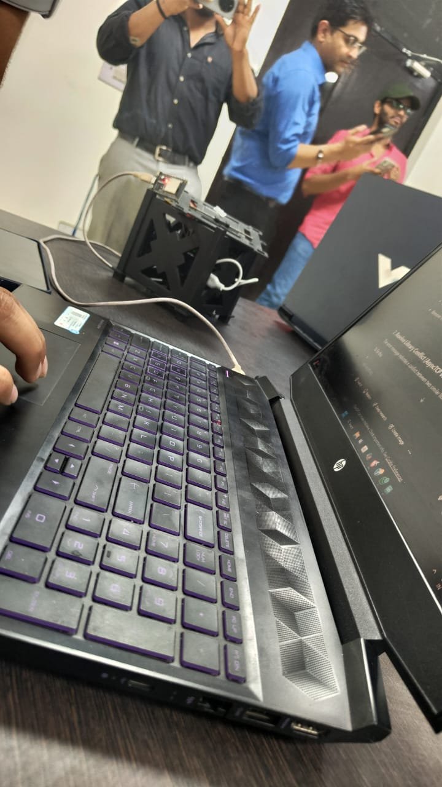
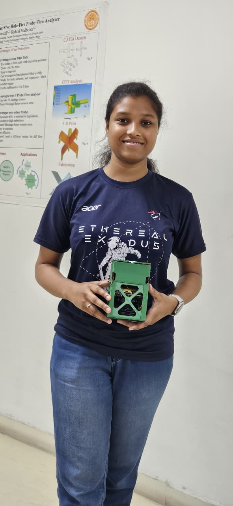
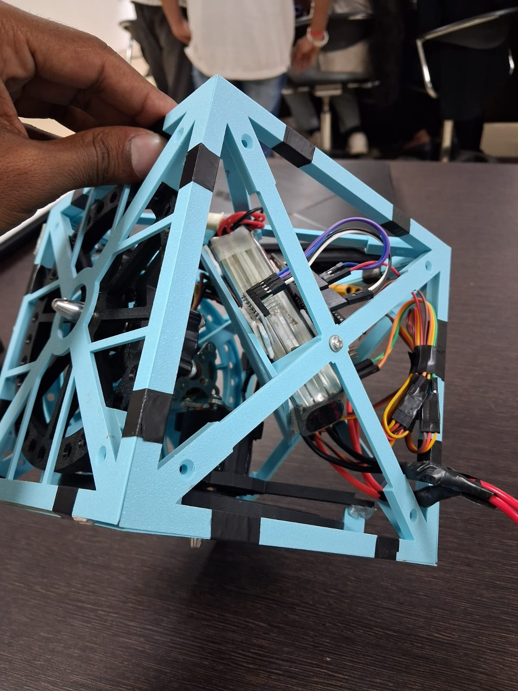
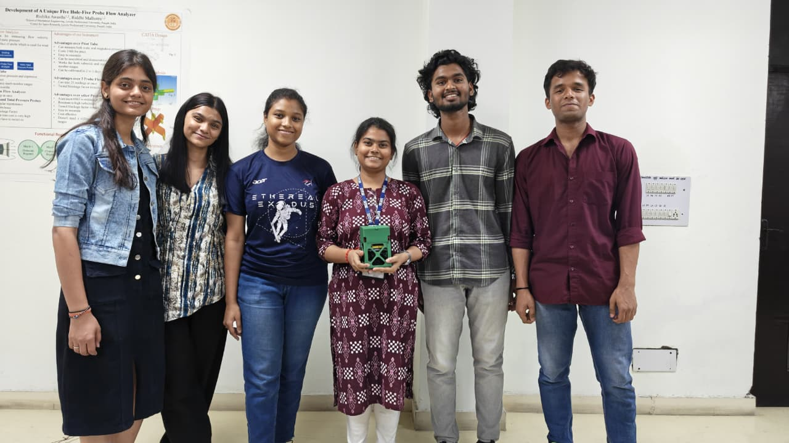

# 🛰️ LUMISAT – 1.5U CubeSat for Artificial Light Pollution Monitoring

## Project Overview

**LUMISAT** is a **1.5U CubeSat prototype** developed to monitor **artificial light pollution** using onboard sensors, embedded electronics, and a real-time telemetry system.

The project demonstrates the complete development cycle of a CubeSat—from mission planning and structural design to subsystem integration, telemetry development, and prototype validation. It combines **Space Systems Engineering**, **Embedded Systems**, **Structural Analysis**, **CAD Design**, and **Environmental Monitoring** into a single multidisciplinary engineering project.

---

## Mission Objectives

* Develop a lightweight and structurally optimized 1.5U CubeSat.
* Monitor artificial light pollution using onboard optical sensors.
* Design and integrate multiple satellite subsystems.
* Develop a real-time telemetry and ground station interface.
* Validate subsystem integration through prototype testing.
* Demonstrate an educational CubeSat platform for environmental monitoring.

---

## Mission Architecture

LUMISAT was designed as a modular CubeSat consisting of the following major subsystems:

* Payload Module
* Onboard Computer
* Sensor Suite
* Communication System
* Power Distribution System
* Structural Frame
* Ground Station Interface

---

## CubeSat Structural Design

The CubeSat structure was designed using CAD software and optimized for strength, weight, and manufacturability.

### Engineering Activities

* 3D CAD Modeling
* Structural Design
* Assembly Design
* Finite Element Analysis (FEA)
* 3D Printing
* Structural Optimization

### CubeSat Structure

---

## Embedded Electronics & Payload

The onboard electronics integrate sensing, processing, communication, and power management into a compact CubeSat architecture.

### Hardware Components

* Bharat Pi
* ESP32-S3 DevKitM-1
* Custom PCB
* Li-Po Battery
* Buck Converter
* ESP32 Camera Module
* Servo Mechanism

### Payload Integration

---

## Sensor Payload

The environmental monitoring payload consists of:

* TCS34725 RGB Color Sensor
* Photodiode
* BMP581 Pressure Sensor
* MPU6050 Inertial Measurement Unit
* ESP32 Camera Module

These sensors enable environmental data collection, orientation measurement, and light pollution analysis.

---

## Telemetry & Ground Station

A wireless telemetry system was developed to transmit sensor data from the CubeSat to a ground station for real-time monitoring.

### Features

* ESP32-based Communication
* Real-Time Sensor Monitoring
* Firebase Cloud Integration
* Web-Based Dashboard
* Data Logging

### Ground Station Testing

---

## Prototype Development

The completed CubeSat prototype demonstrates successful integration of structural, electronic, and software subsystems.

### Final Prototype

### Internal Assembly

---

## Engineering Workflow

1. Mission Planning
2. CubeSat Architecture Design
3. CAD Modeling
4. Structural Analysis
5. 3D Printing
6. PCB Design & Assembly
7. Sensor Integration
8. Embedded Programming
9. Telemetry Development
10. Ground Station Development
11. Prototype Assembly
12. Testing & Validation

---

## Project Outcomes

The project successfully achieved:

* Development of a functional 1.5U CubeSat prototype
* Structural validation using Finite Element Analysis
* Successful integration of multiple onboard sensors
* Real-time telemetry and cloud-based data monitoring
* Functional ground station communication
* End-to-end subsystem integration and prototype validation

---

## Software & Engineering Tools

### CAD & Design

* SolidWorks
* Fusion 360

### Simulation & Analysis

* ANSYS Workbench
* Finite Element Analysis (FEA)

### Embedded Systems

* Arduino IDE
* ESP32 Platform

### Cloud & Telemetry

* Firebase
* Web Serial API
* JavaScript

---

## Skills Demonstrated

* Space Systems Engineering
* CubeSat Design
* Structural Design
* CAD Modeling
* Finite Element Analysis (FEA)
* Embedded Systems
* Sensor Integration
* PCB Design
* Telemetry Systems
* Ground Station Development
* Environmental Monitoring
* Systems Integration
* Engineering Prototyping

---

## Project Gallery

### CubeSat Structure

### Payload Integration

### Project Team

### Final Prototype

### Internal Electronics

### Ground Station Demonstration

---

## 📄 Technical Report

The complete project report is available in this repository.

📥 **[Download LUMISAT Project Report](report/LUMISAT.pdf)**

---

## Future Scope

* Orbit-ready CubeSat development
* Solar panel integration
* ADCS implementation
* LoRa/UHF communication
* Thermal vacuum testing
* Radiation testing
* Flight-qualified CubeSat platform
* AI-assisted onboard data processing

---

## Contributors

* **Laxmipriya Murmu**
* Shreyansh Tiwari
* Kushagra Mittal
* Aman Kumar
* Raghav Mahajan
* Ankit Kumar

### Faculty Mentor

**Mr. Harikrishna Chavan**

---

> **Academic Project**
> Department of Aerospace Engineering
> Lovely Professional University
