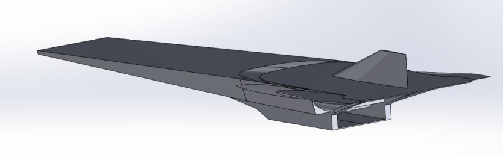
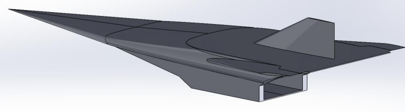
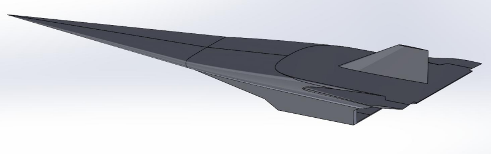
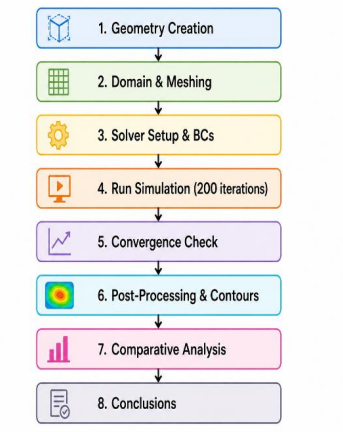
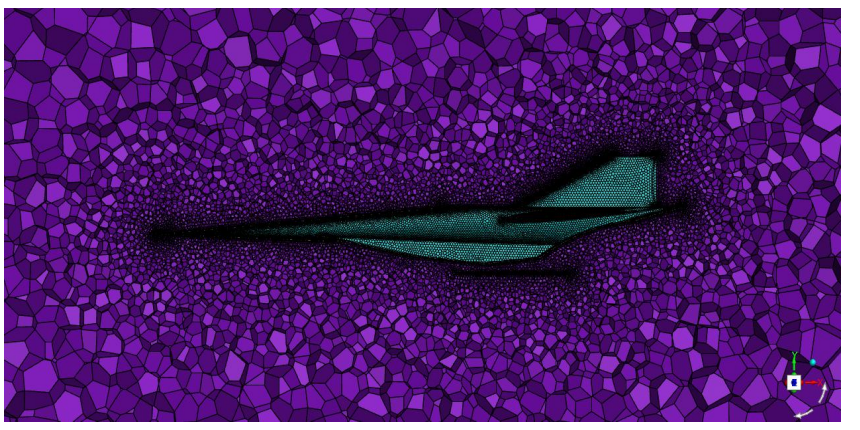
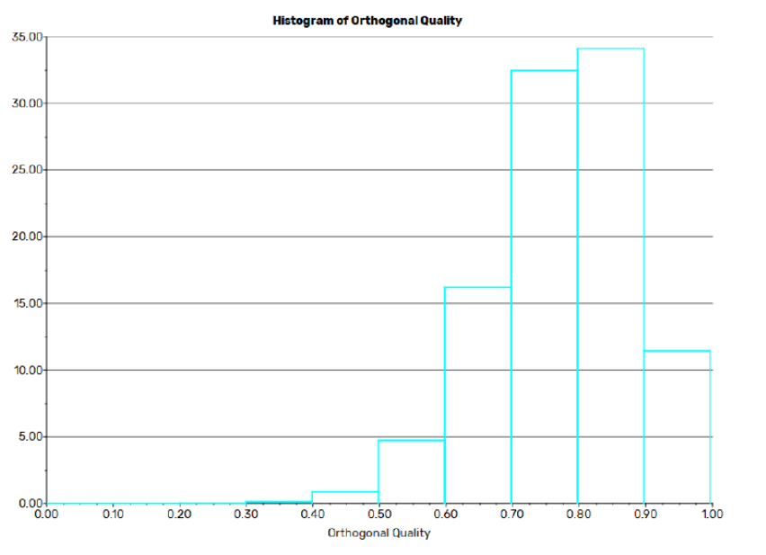
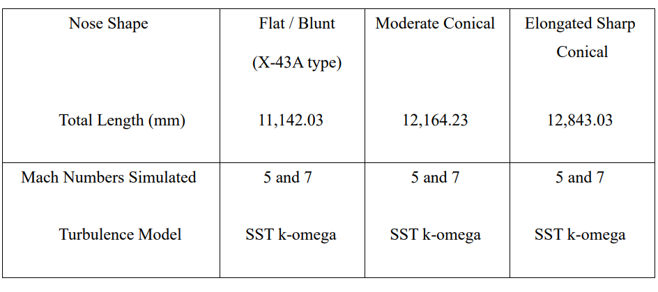
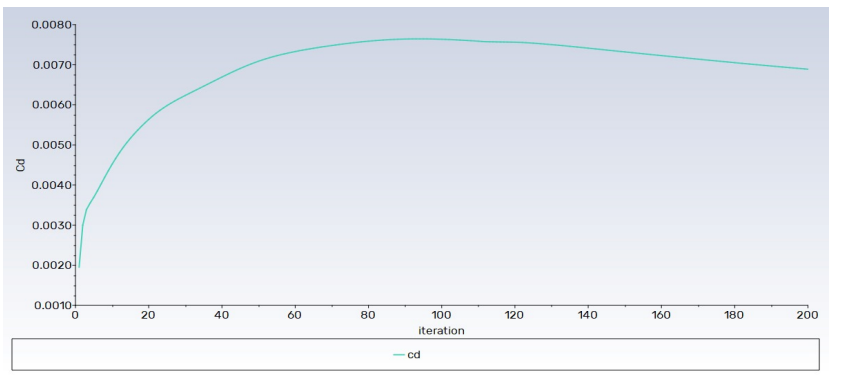

# Aerodynamics Performance Analysis of Hypersonic Vehicles

Computational Fluid Dynamics (CFD) analysis of three hypersonic vehicle configurations operating at Mach 5 and Mach 7. The project investigates the influence of nose geometry on aerodynamic performance, shock-wave behavior, pressure distribution, temperature rise, and drag characteristics using ANSYS Fluent.

---

## Project Overview

Hypersonic vehicles experience complex aerodynamic phenomena due to strong shock waves, extreme temperatures, and compressibility effects.

This study compares three vehicle configurations:

- Model 1 – NASA X-43A inspired blunt nose
- Model 2 – Moderate conical nose
- Model 3 – Elongated sharp conical nose

The objective was to determine how nose geometry affects drag coefficient, lift coefficient, pressure distribution, temperature distribution, and overall aerodynamic efficiency.

---

## Vehicle Configurations

### Model 1 – Flat Blunt Nose

### Model 2 – Moderate Conical Nose

### Model 3 – Elongated Sharp Conical Nose

---

## CFD Methodology

The analysis workflow consisted of:

1. Geometry Creation
2. Computational Domain Creation
3. Mesh Generation
4. Solver Configuration
5. Convergence Analysis
6. Post Processing
7. Comparative Performance Evaluation

---

## Mesh Generation

### Computational Mesh

### Mesh Quality Assessment

Key characteristics:

- Unstructured tetrahedral mesh
- ~4.14 Million cells
- ~8.41 Million faces
- ~756,000 nodes

---

## Simulation Setup

### Software

- ANSYS Fluent 2024 R1

### Turbulence Model

- SST k-ω

### Solver

- Density-Based Implicit Solver

### Working Fluid

- Air (Ideal Gas)

### Mach Numbers Investigated

- Mach 5
- Mach 7

---

## Sample Results

### Convergence History

### Drag Coefficient Evolution

---

## Key Findings

- Blunt nose configuration generated the strongest detached bow shock.
- Sharp conical nose reduced aerodynamic drag significantly.
- Shock stand-off distance decreased with increasing nose sharpness.
- Model 3 demonstrated the best aerodynamic efficiency at hypersonic speeds.
- Surface temperature concentration increased near sharper nose tips.
- Aerodynamic performance strongly depended on nose geometry.

---

## Skills Demonstrated

- Computational Fluid Dynamics (CFD)
- ANSYS Fluent
- Aerospace Aerodynamics
- Hypersonic Flow Analysis
- Mesh Generation
- Numerical Simulation
- Post Processing
- Engineering Research

---

## Project Report

Complete technical report:

[Hypersonic CFD Report](report/hypersonic-cfd-report.pdf)

---

## Authors

Laxmipriya Murmu  
B.Tech Aerospace Engineering  
Lovely Professional University

Project Team:
- Laxmipriya Murmu
- Gowtham Kumar Talla
- Shaikh Mohd Zafar Iqbal Jawaid Ashraf
- Mounish Damera
- Jitesh Jambulkar

Faculty Guide:
- Dr. Rahul Kumar
