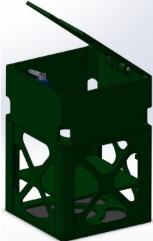
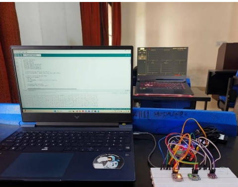
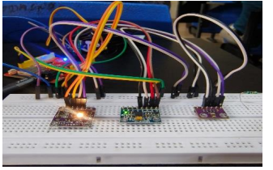
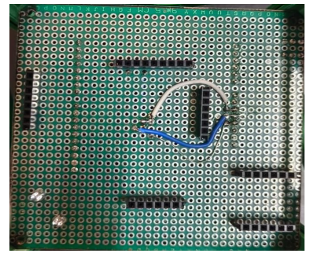
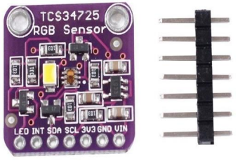
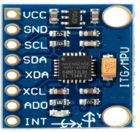
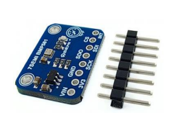
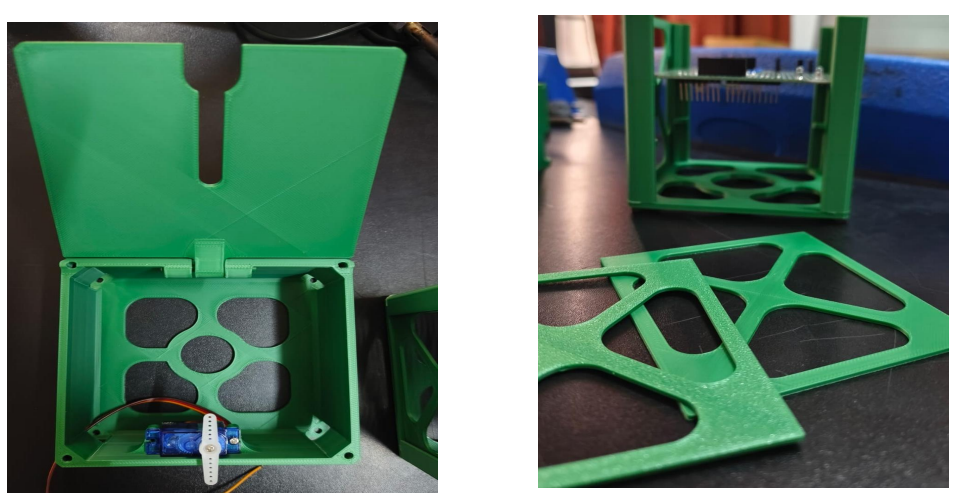
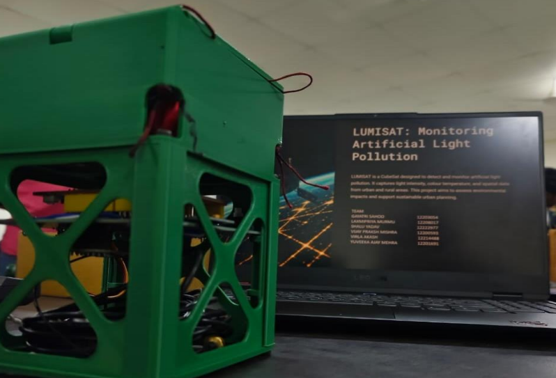
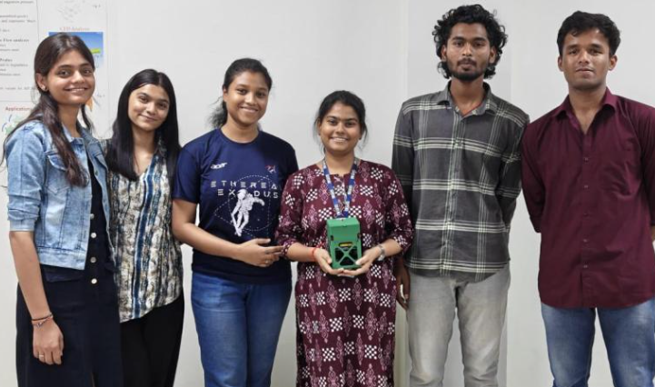

# LUMISAT – CubeSat for Artificial Light Pollution Monitoring

## Overview

LUMISAT is a 1.5U CubeSat developed to monitor artificial light pollution through onboard environmental sensing, telemetry transmission, and real-time data visualization.

The project combines aerospace systems engineering, embedded electronics, telemetry, structural design, and environmental monitoring to study the impact of artificial lighting on ecosystems and urban environments.

---

## Project Report

📄 Full Report:

[View Project Report](report/LUMISAT.pdf)

---

## Mission Objectives

* Detect and monitor artificial light sources
* Measure light intensity and color characteristics
* Analyze environmental parameters in real time
* Demonstrate CubeSat subsystem integration
* Develop telemetry and ground station capabilities
* Validate low-cost environmental monitoring concepts

---

## CubeSat Specifications

| Parameter          | Value                    |
| ------------------ | ------------------------ |
| Platform           | 1.5U CubeSat             |
| Dimensions         | 10 cm × 10 cm × 15 cm    |
| Structure Material | PLA                      |
| Power System       | 7.7V 2000 mAh Li-Po      |
| Telemetry          | Wi-Fi + Firebase         |
| Recovery System    | Servo-Deployed Parachute |
| Controller         | ESP32-S3 / Bharat Pi     |

---

## Technologies Used

* Fusion 360
* SolidWorks
* ANSYS Workbench
* ESP32-S3
* Firebase
* PCB Design
* Sensor Integration
* Embedded Systems
* Aerospace Systems Engineering

---

## Structural Design

### CubeSat Structural Model



The CubeSat structure was designed as a lightweight 1.5U platform optimized for payload integration, manufacturability, and recovery operations.

---

### Parachute Bay Integration



A dedicated deployment section was incorporated to enable controlled recovery through a parachute mechanism.

---

## Electronics Development

### Breadboard Prototyping



All sensors and communication modules were validated through hardware prototyping before PCB fabrication.

---

### PCB Development



A custom double-layer PCB was developed to integrate sensing, telemetry, and power management subsystems.

---

## Sensor Payload

### TCS34725 RGB Sensor



Used for measuring RGB light intensity and color characteristics.

---

### MPU6050 IMU



Used for motion sensing, orientation monitoring, and deployment analysis.

---

### BMP581 Sensor



Used for pressure, temperature, and altitude estimation.

---

## Recovery System Testing

### Parachute Deployment Validation



Recovery testing was performed to validate descent stability and safe payload recovery.

---

## Final Assembly

### Integrated CubeSat Prototype



Final integrated CubeSat incorporating structure, electronics, sensors, and recovery mechanisms.

---

## Team

### LUMISAT Development Team



The project was developed through a multidisciplinary team effort involving aerospace design, electronics integration, telemetry development, and environmental sensing.

---

## Telemetry System

The CubeSat telemetry architecture was developed using:

* ESP32-S3
* Firebase Realtime Database
* Environmental Sensors
* Real-Time Data Streaming

Measured parameters included:

* Light Intensity
* RGB Values
* Pressure
* Temperature
* Altitude
* Accelerometer Data
* Gyroscope Data

Firmware available in:

```text
transmission-code.ino
```

---

## Key Outcomes

* Successful CubeSat structural development
* Sensor payload integration
* Real-time telemetry transmission
* Environmental data acquisition
* PCB design and fabrication
* Recovery system validation
* Ground station visualization capability

---

## Skills Demonstrated

* Space Systems Engineering
* CubeSat Development
* Embedded Systems
* Telemetry Systems
* PCB Design
* Sensor Integration
* Finite Element Analysis
* CAD Modeling
* Aerospace Project Development

---

## Author

**Laxmipriya Murmu**

B.Tech Aerospace Engineering
Lovely Professional University

🚀 Rocket Propulsion | 🛰️ Space Systems | ✈️ CFD & Aerodynamics

[LinkedIn](https://www.linkedin.com/in/laxmipriyamurmu/)

[GitHub](https://github.com/laxmipriyamurmu)
